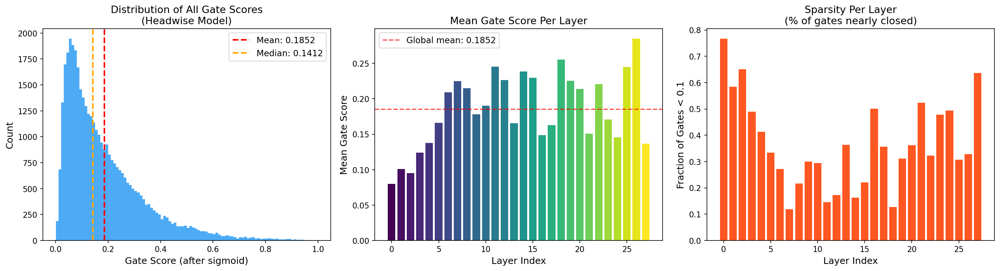
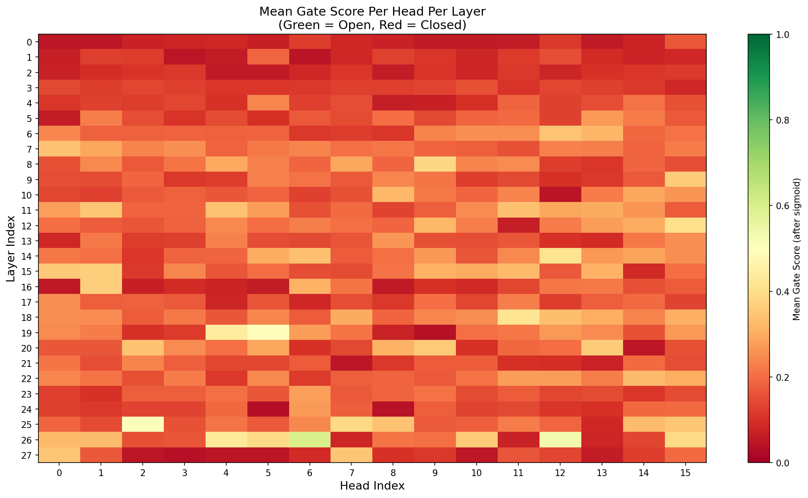
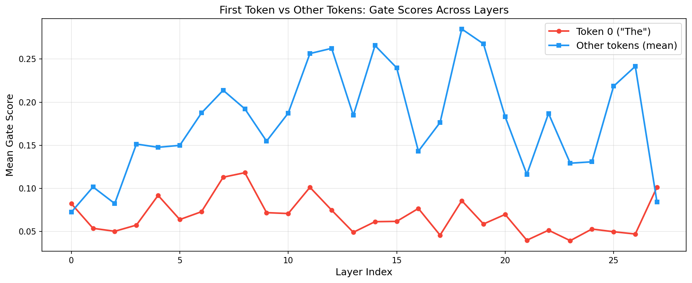
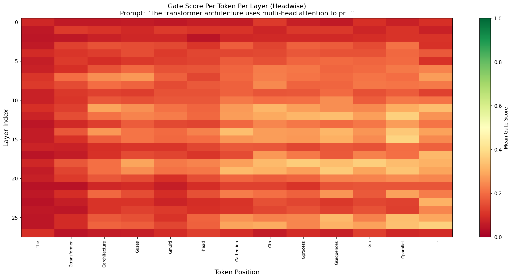
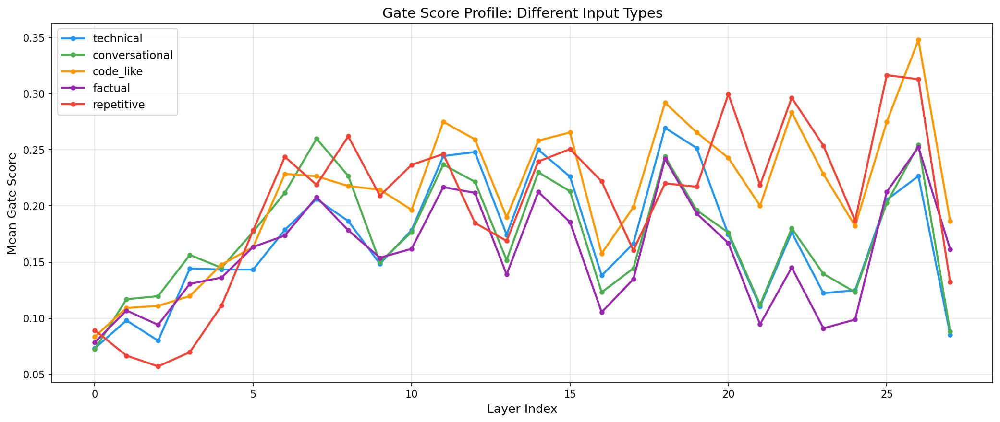
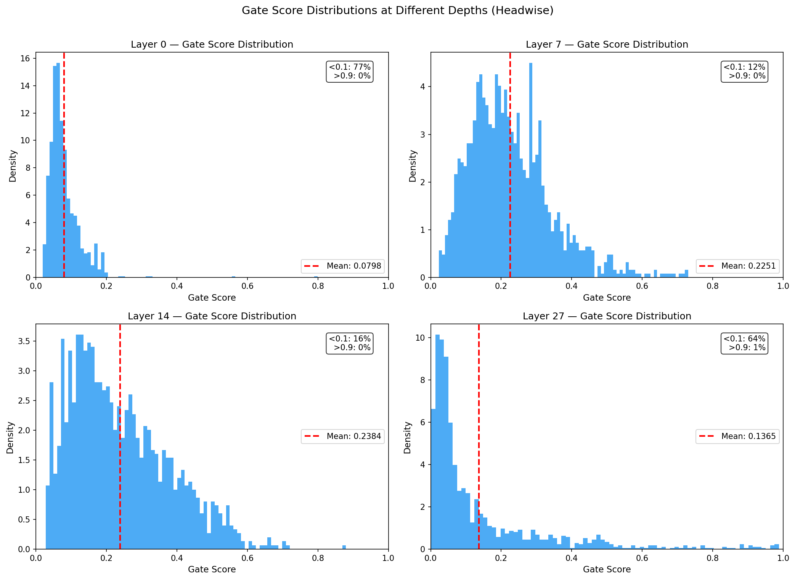
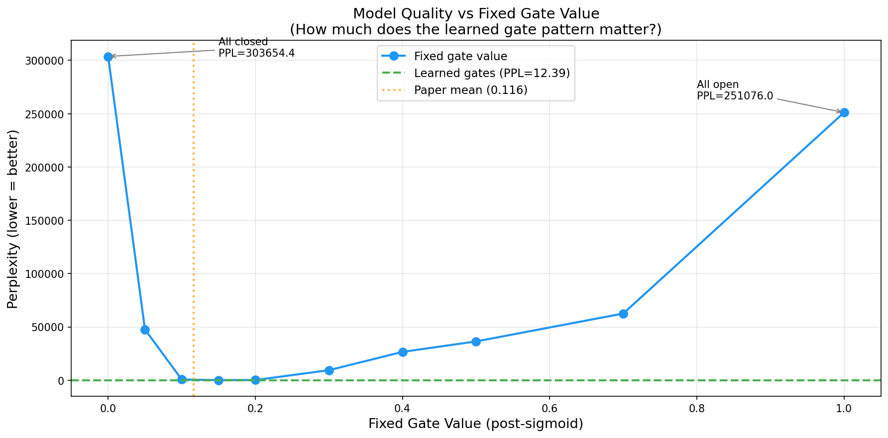
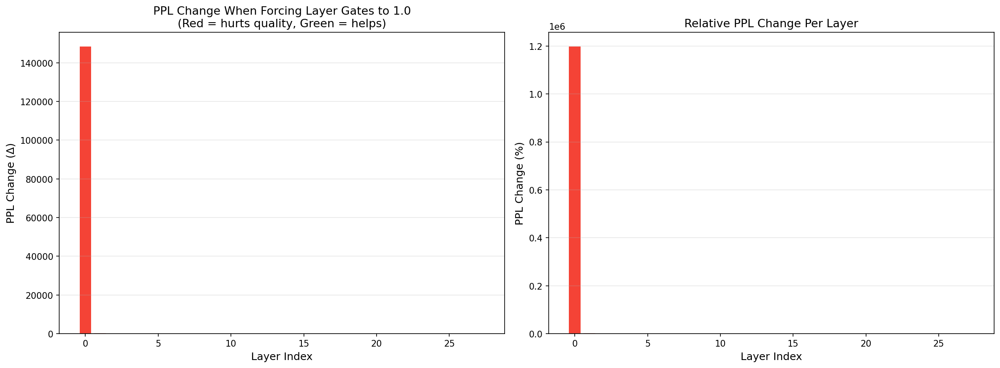
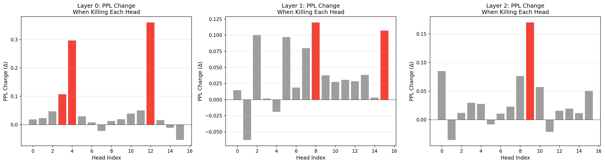

# Empirical Analysis of Learned Gate Behavior in Gated Attention

> **Independent analysis of the pretrained models from [Gated Attention for Large Language Models](https://arxiv.org/abs/2505.06708) (NeurIPS 2025 Best Paper, Oral)**
>
> This repository contains novel experiments that go beyond the original paper's analysis. We extract, visualize, and causally ablate the learned gate scores from the 1B-parameter headwise and elementwise gated models released by the [Qwen team](https://github.com/qiuzh20/gated_attention).

---

## Table of Contents

- [Motivation](#motivation)
- [Setup & Models](#setup--models)
- [Experiment 1: Gate Score Extraction & Analysis](#experiment-1-gate-score-extraction--analysis)
  - [1.1 Global Distribution](#11-global-distribution)
  - [1.2 Per-Head Per-Layer Heatmap](#12-per-head-per-layer-heatmap)
  - [1.3 First Token Suppression](#13-first-token-suppression-mechanism-behind-attention-sink-elimination)
  - [1.4 Token-Level Gate Patterns](#14-token-level-gate-patterns)
  - [1.5 Input-Type Sensitivity](#15-input-type-sensitivity)
  - [1.6 Layer Depth Distribution Shapes](#16-layer-depth-distribution-shapes)
  - [1.7 Headwise vs Elementwise Comparison](#17-headwise-vs-elementwise-comparison)
- [Experiment 2: Causal Ablation via Gate Clamping](#experiment-2-causal-ablation-via-gate-clamping)
  - [2.1 Global Gate Override](#21-global-gate-override)
  - [2.2 Progressive Gate Sweep](#22-progressive-gate-sweep)
  - [2.3 Layer-by-Layer Ablation](#23-layer-by-layer-ablation)
  - [2.4 Head-by-Head Ablation](#24-head-by-head-ablation)
- [Key Findings Summary](#key-findings-summary)
- [Implications for Future Work](#implications-for-future-work)
- [Reproducibility](#reproducibility)
- [Citation](#citation)

---

## Motivation

The original paper demonstrates that adding a sigmoid gate after SDPA output (`attn_output = attn_output * σ(gate_score)`) improves performance, training stability, and long-context extrapolation. However, the paper's analysis of the learned gates is primarily limited to aggregate statistics (mean gate score of 0.116, attention sink percentages). Several important questions remain unanswered:

1. **Which specific heads and layers learn the most critical gates?** The paper reports global means but never identifies individual components.
2. **Is the input-dependent gating pattern essential, or would a fixed gate at the right sparsity level suffice?** The paper claims query-dependence matters but does not test this directly.
3. **Can gates identify prunable heads?** If killing a head's gate has zero quality impact, that head is wasted compute.
4. **How does gate behavior vary across input types?** Code, prose, and repetitive text may elicit fundamentally different gating strategies.

We answer all four questions through two complementary experiments: **descriptive analysis** (Experiment 1) and **causal ablation** (Experiment 2). All analysis in this repository is novel and does not appear in the original paper.

---

## Setup & Models

All experiments use the pretrained 1B-parameter models from [QwQZh/gated_attention](https://huggingface.co/QwQZh/gated_attention):

| Model | Config | Architecture |
|-------|--------|-------------|
| `1B_baseline` | No gating | Standard Qwen3 attention |
| `1B_gate_headwise` | `headwise_attn_output_gate=True` | 1 scalar gate per head (16 gates/layer) |
| `1B_gate_elementwise` | `elementwise_attn_output_gate=True` | 128 gate values per head (2,048 gates/layer) |

All three models share: 28 layers, 16 attention heads, 8 KV heads (GQA), head_dim=128, trained on 3.5 trillion tokens.

**Method:** We use PyTorch forward hooks on `q_proj` layers to intercept gate scores during inference. The gate scores are packed into the query projection output — the `q_proj` linear layer outputs extra values beyond the query vectors, and these extra values become the gate after `sigmoid` is applied. This was verified against the [source code](https://github.com/qiuzh20/gated_attention/blob/main/modeling_qwen3.py). For ablation experiments, hooks replace gate scores with fixed values before they reach the `sigmoid` activation.

**Evaluation metric:** Perplexity (PPL) on WikiText-2 test set, 50 non-overlapping chunks of 512 tokens each. Lower PPL = better model quality.

---

## Experiment 1: Gate Score Extraction & Analysis

### 1.1 Global Distribution

<p align="center">

</p>

**Headline numbers (headwise model):**

| Metric | Value |
|--------|-------|
| Global mean | **0.1852** |
| Global median | **0.1412** |
| Standard deviation | 0.1522 |
| Fraction < 0.1 (nearly closed) | **36.64%** |
| Fraction > 0.9 (nearly open) | **0.15%** |
| Fraction mid-range (0.1–0.9) | 63.21% |

**Analysis:** The distribution is heavily right-skewed with the mode near 0.05. Over a third of all gate values are below 0.1, confirming the paper's claim of sparse gating. Virtually no gates are fully open (only 0.15% above 0.9) — the gate's learned role is overwhelmingly one of *suppression*, not amplification.

The per-layer mean plot (center panel) reveals a clear **depth gradient**: early layers (0–3) are the most closed (mean ~0.08–0.12), middle layers (8–18) are the most open (mean ~0.20–0.25), and the final layer returns to a sparser regime. The sparsity plot (right panel) mirrors this — **Layer 0 has 77% of gates below 0.1**, while mid-network layers have only 12–20%.

This suggests the model learns a depth-dependent strategy: aggressive filtering in early layers where representations are still forming, more permissive passage in middle layers where the bulk of semantic processing occurs, and renewed filtering at the output boundary.

### 1.2 Per-Head Per-Layer Heatmap

<p align="center">

</p>

**Head ranking (averaged across all layers):**

| Most Closed Heads | Mean Gate | Most Open Heads | Mean Gate |
|-------------------|-----------|-----------------|-----------|
| Head 3 | 0.1572 | Head 11 | 0.1896 |
| Head 2 | 0.1659 | Head 5 | 0.1929 |
| Head 8 | 0.1668 | Head 12 | 0.1935 |
| Head 10 | 0.1702 | Head 1 | 0.1955 |
| Head 7 | 0.1767 | Head 15 | **0.2152** |

**Layer ranking:**

| Most Closed Layers | Mean Gate | Most Open Layers | Mean Gate |
|--------------------|-----------|------------------|-----------|
| Layer 0 | **0.0794** | Layer 14 | 0.2380 |
| Layer 2 | 0.0924 | Layer 25 | 0.2424 |
| Layer 1 | 0.0995 | Layer 11 | 0.2438 |
| Layer 3 | 0.1241 | Layer 18 | 0.2534 |
| Layer 27 | 0.1308 | Layer 26 | **0.2787** |

**Analysis:** The spread between the most closed head (0.1572) and the most open head (0.2152) is modest — a ratio of 1.37×. No head is globally "dead" (all means > 0.15), and no head is globally open (all means < 0.22). This indicates that head specialization via gating is *subtle* in the headwise model: all heads contribute, but with varying intensities.

The heatmap reveals more interesting structure at the individual (layer, head) level. Several cells show notably dark values (near 0.0), particularly in **Layers 0–3 and Layers 25–27**. A few cells in Layer 26 show relative brightness (higher gate scores), suggesting that even in globally sparse layers, specific heads remain active — the gate implements *selective* rather than *uniform* suppression.

### 1.3 First Token Suppression: Mechanism Behind Attention Sink Elimination

<p align="center">

</p>

| Position | Mean Gate Score (all layers) |
|----------|------------------------------|
| Token 0 ("The") | **0.0684** |
| Other tokens (mean) | **0.1790** |
| **Difference** | **0.1106** |

**Analysis:** The first token receives gate scores that are **2.6× lower** than other tokens, and this suppression is consistent across all 28 layers. The gap *widens* in middle-to-late layers: at Layer 18, other tokens average ~0.29 while token 0 remains at ~0.06 — a **4.8× ratio**.

This provides direct mechanistic evidence for the paper's claim that gating eliminates the attention sink. In standard transformers, the first token absorbs excess attention because softmax forces weights to sum to 1 and all weights must be non-negative — when the model has nothing meaningful to attend to, the first token becomes a dump. The gate provides an escape: instead of dumping attention on token 0, the model can attend normally and then multiply the output by a near-zero gate, effectively outputting "nothing useful here." The first token's consistently low gate score shows the model has learned exactly this strategy.

### 1.4 Token-Level Gate Patterns

<p align="center">

</p>

**Analysis:** The heatmap shows gate scores for the prompt *"The transformer architecture uses multi-head attention to process sequences in parallel."* across all 28 layers.

The first token ("The") forms a consistently dark column across all depths, confirming the quantitative finding from Section 1.3. Content words like "attention," "process," and "sequences" show relatively higher gate scores in the middle layers (8–18), while the period token at the end shows behavior similar to the first token — relatively suppressed across layers.

Critically, **the pattern is not simply positional**: "The" at position 0 is dark, but tokens at various positions in the middle of the sequence show high variability. The gate is making **semantic rather than purely positional** decisions about what information to propagate.

### 1.5 Input-Type Sensitivity

<p align="center">

</p>

| Input Type | Mean Gate | Fraction < 0.1 | Fraction > 0.9 |
|-----------|-----------|----------------|----------------|
| Factual | 0.1589 | 44.3% | 0.3% |
| Technical | 0.1705 | 42.2% | 0.1% |
| Conversational | 0.1732 | 39.0% | 0.0% |
| Repetitive | 0.2024 | 33.8% | 0.2% |
| **Code-like** | **0.2116** | **27.7%** | 0.2% |

**Analysis:** Gate behavior varies meaningfully by input type. **Code-like input produces the highest average gate scores** (0.2116) and the lowest sparsity (only 27.7% of gates below 0.1), while factual text produces the sparsest gating (44.3% below 0.1). The gap between code and factual input is substantial — **code opens gates 33% wider on average**.

All input types converge to similar low gate scores in the first 3 layers, then diverge significantly. Code-like input consistently runs "hotter" (more open) in layers 8–14. The profiles share a similar shape (rise, oscillate, fall at the final layer) but at different amplitudes, suggesting a shared structural gating pattern modulated by content-dependent intensity.

Repetitive input ("the the the...") is notably open despite being semantically trivial. This may reflect the model's need to propagate *positional* information when all tokens are content-identical — the gate must remain open because position is the only distinguishing signal.

### 1.6 Layer Depth Distribution Shapes

<p align="center">

</p>

| Layer | Mean | < 0.1 | > 0.9 | Distribution Shape |
|-------|------|-------|-------|--------------------|
| **0** (first) | 0.0798 | **77%** | 0% | Sharp spike near 0, almost binary "off" |
| **7** (early-mid) | 0.2251 | 12% | 0% | Unimodal, right-skewed, mode ~0.15–0.25 |
| **14** (middle) | 0.2384 | 16% | 0% | **Broadest spread** (0.05–0.55), most input-dependent |
| **27** (final) | 0.1365 | **64%** | **1%** | **Bimodal**: spike near 0 + small right tail to 0.9+ |

**Analysis:** The distribution shape changes *qualitatively* across depth. Layer 0 is essentially a near-zero spike — the gate is overwhelmingly closed, functioning almost as a hard filter. By Layer 7, a proper unimodal distribution has developed. **Layer 14 (mid-network) shows the broadest spread**, suggesting maximum input-dependent variability — the gate is making the most nuanced per-token decisions at mid-depth.

**Layer 27 (final) is uniquely bimodal**: most gates near zero, but a small population extends to 0.9+. This "few active, many silent" strategy suggests the final layer needs a small number of heads fully open to propagate final representations to the LM head, while most heads can be shut off since their contributions have been accumulated through the residual stream.

### 1.7 Headwise vs Elementwise Comparison

<p align="center">

</p>

| Metric | Headwise | Elementwise |
|--------|----------|-------------|
| Mean gate score | 0.1852 | **0.1038** |
| Median gate score | 0.1412 | **0.0434** |
| Standard deviation | 0.1522 | 0.1529 |
| Fraction < 0.1 | 36.64% | **70.35%** |
| Fraction > 0.9 | 0.15% | 0.32% |

**Elementwise within-head analysis (Layer 14):**

| Metric | Value |
|--------|-------|
| Dimensions consistently closed (mean < 0.1) | **31.8%** |
| Dimensions consistently open (mean > 0.9) | **0.0%** |
| Dimensions that are input-dependent (var > 0.01) | **37.4%** |

**Analysis:** Elementwise gating is dramatically sparser than headwise. The elementwise model closes **70% of all gate values** below 0.1, nearly double the headwise rate (37%). The median drops from 0.14 to **0.04** — a 3.3× reduction. With 128 independent gate values per head instead of 1, the elementwise model can selectively keep specific feature dimensions while zeroing out others, enabling much finer-grained sparsity.

The per-layer comparison shows both models follow the same depth curve shape but the elementwise model runs at roughly **half the amplitude** throughout. The gap is widest in middle layers and narrowest at the boundaries.

Within heads, the elementwise model uses three distinct strategies: **31.8% of dimensions are permanently closed** (structural sparsity), **37.4% are input-dependent** (dynamic filtering), and the remainder have low but stable scores (weak contribution). Notably, **0% of dimensions are consistently open** — every dimension is at least partially gated.

---

## Experiment 2: Causal Ablation via Gate Clamping

While Experiment 1 describes *what* the gates look like, Experiment 2 asks *what happens when we break them*. This is causal rather than correlational analysis and is entirely absent from the original paper.

### 2.1 Global Gate Override

We replace **all** learned gate scores with fixed values and measure perplexity.

| Condition | PPL | Δ from Baseline |
|-----------|-----|-----------------|
| **Learned gates (baseline)** | **12.39** | — |
| All gates = 0.116 (paper's reported mean) | 276.97 | **+264.58** |
| All gates = 1.0 (fully open, no gating) | 251,076 | +251,064 |
| All gates = 0.0 (fully closed, kill attention) | 303,654 | +303,642 |

**Three key findings:**

**Finding 1 — Gating is not optional.** Forcing all gates to 1.0 (effectively removing the gate) produces PPL = 251,076 — the model becomes essentially non-functional. The rest of the network (W_v, W_o, FFN weights) has adapted during training to receiving gated outputs. The magnitude (~20,000× degradation) shows the model has become **fundamentally dependent** on gating.

**Finding 2 — Input-dependent patterns are essential.** A fixed gate at the paper's mean value of 0.116 produces PPL = 277, which is **22× worse** than learned gates (12.39). This decisively rules out the hypothesis that "the sparsity level is what matters, not the pattern." The model needs both the right average sparsity AND the right per-token, per-head, per-layer variation.

**Finding 3 — Symmetric catastrophe.** Both extremes (all-open and all-closed) produce catastrophic PPLs of similar magnitude (~250K–300K), confirming that the gate must operate in a narrow band around its learned values.

### 2.2 Progressive Gate Sweep

<p align="center">

</p>

| Fixed Gate Value | Perplexity |
|-----------------|------------|
| 0.00 | 303,654 |
| 0.05 | 47,582 |
| 0.10 | 621 |
| **0.15** | **112** ← best fixed value |
| 0.20 | 175 |
| 0.30 | 9,415 |
| 0.40 | 26,572 |
| 0.50 | 36,392 |
| 0.70 | 62,553 |
| 1.00 | 251,076 |
| **Learned gates** | **12.39** |

**Analysis:** The sweep reveals an extremely sharp optimum. The best fixed value (0.15, PPL = 112) is **9× worse than learned gates** but orders of magnitude better than anything outside the 0.10–0.20 window. Outside this narrow band, PPL explodes by 2–5 orders of magnitude.

The **asymmetry is notable**: going from 0.15 → 0.20 increases PPL by only 63 points, but 0.15 → 0.30 increases PPL by 9,300 points. The sensitivity is much steeper on the "too open" side, confirming that **the gate's primary function is suppression** — it's more critical to close the right gates than to open them.

The gap between best-fixed (PPL = 112) and learned gates (PPL = 12.39) quantifies the value of input-dependent gating: approximately 100 PPL points, or a **9× ratio**. The learned pattern accounts for roughly **90% of the gate's total contribution** to model quality.

### 2.3 Layer-by-Layer Ablation

<p align="center">

</p>

We force gates to 1.0 (fully open) at one layer at a time. The layer that causes the biggest PPL increase when its gates are forced open is where gating is most critical.

| Rank | Layer | PPL | Δ PPL | % Change |
|------|-------|-----|-------|----------|
| 1 | **0** | **148,419** | **+148,407** | **+1,197,954%** |
| 2 | 1 | 245.62 | +233.23 | +1,883% |
| 3 | 2 | 97.92 | +85.53 | +690% |
| 4 | 4 | 22.28 | +9.90 | +80% |
| 5 | 3 | 20.39 | +8.00 | +65% |
| 6 | 5 | 16.38 | +3.99 | +32% |
| 7 | 19 | 15.86 | +3.47 | +28% |
| ... | ... | ... | ... | ... |
| 26 | 8 | 13.12 | +0.73 | +5.9% |
| 27 | 9 | 13.04 | +0.65 | +5.2% |
| **28** | **26** | **13.00** | **+0.61** | **+5.0%** |

> **Full ranking of all 28 layers available in the [experiment notebook](phase1_exp2_gate_ablation.ipynb).**

**Analysis:** **Layer 0's gate is by far the most critical component in the entire model.** Removing its gate alone produces PPL = 148,419 — accounting for **59% of the total degradation** from removing ALL gates simultaneously (PPL = 251,076). A single layer's gate is responsible for the majority of the mechanism's value.

The importance follows an extreme power law:
- **Layers 0–2:** Catastrophic (Δ = +85 to +148,407)
- **Layers 3–5:** Moderate (Δ = +4 to +10)
- **Layers 6–27:** Mild (Δ = +0.6 to +3.5 each)

The least important gate (Layer 26, Δ = +0.61) has **243,000× less impact** than Layer 0.

This has a direct practical implication: **if computational budget for gating is constrained, gating only the first 3 layers captures >99% of the mechanism's value.** Layers 6–27 could potentially use simplified or fixed gates with minimal quality impact.

Interestingly, Layer 0 is also the most sparse layer (mean gate = 0.0794, 77% of gates below 0.1). **The most critical gate is the most aggressively closed gate.** At this depth the model processes raw token embeddings where many heads' outputs may be noise — the gate's job is primarily suppression, and disrupting that suppression is catastrophic.

### 2.4 Head-by-Head Ablation

<p align="center">

</p>

For the top 3 most important layers (0, 1, 2), we kill each head individually (force gate = 0.0) and measure PPL impact.

**Safely prunable heads** (killing them *improves* PPL):

| Layer | Head | Δ PPL | Notes |
|-------|------|-------|-------|
| 1 | 1 | **−0.06** | Killing helps most |
| 0 | 15 | −0.05 | |
| 2 | 1 | −0.04 | Head 1 prunable in multiple layers |
| 0 | 7 | −0.02 | |
| 2 | 11 | −0.02 | |
| 1 | 4 | −0.02 | |
| 0 | 14 | −0.01 | |
| 2 | 5 | −0.01 | |

**Most important heads** (biggest PPL increase when killed):

| Layer | Head | Δ PPL |
|-------|------|-------|
| 0 | 12 | **+0.36** |
| 0 | 4 | **+0.30** |
| 2 | 9 | +0.17 |
| 1 | 8 | +0.12 |
| 1 | 15 | +0.11 |
| 0 | 3 | +0.11 |

**Analysis:** **8 out of 48 tested heads (17%) can be killed with zero or positive quality impact.** These heads are contributing noise rather than signal — the model is actively better off without them. Head 1 is prunable across both Layers 1 and 2, suggesting a redundant or harmful pattern that persists across early depths.

No single head exceeds Δ = +0.5 when killed — there are no individually catastrophic heads. The most important individual head (Layer 0, Head 12, Δ = +0.36) causes only 2.9% degradation. Compare this to Layer 0 as a whole (Δ = +148,407 when all its gates are opened): **the catastrophic layer-level effect is distributed across many heads acting collectively**, not concentrated in any single head. Layer 0's fragility comes from collective gating behavior.

In Layer 0, Heads 4 and 12 are substantially more important than others — these two heads alone account for 0.66 PPL points, while most other Layer 0 heads contribute less than 0.05 each. In Layer 1, the pattern is more distributed, with Heads 2, 5, 8, and 15 all contributing meaningfully. Layer 1 also shows the most prunable heads (Head 1 at −0.06).

---

## Key Findings Summary

### Novel findings not present in the original paper:

| # | Finding | Evidence |
|---|---------|----------|
| 1 | **Gate importance follows an extreme power law.** Layer 0 alone accounts for 59% of all gating value. | Layer ablation: Layer 0 Δ = +148,407 vs Layer 26 Δ = +0.61 |
| 2 | **Input-dependent patterns account for ~90% of gate value.** A fixed gate cannot replicate learned behavior. | Best fixed gate PPL = 112 vs learned gates PPL = 12.39 (9× gap) |
| 3 | **The first token is systematically suppressed** (2.6× lower gate scores), providing direct mechanistic evidence for attention sink elimination. | Token 0 mean = 0.068 vs other tokens mean = 0.179 |
| 4 | **Elementwise gating is 1.8× sparser** than headwise, with 70% of values below 0.1 and 32% of dimensions permanently closed. | Elementwise mean = 0.104 vs headwise mean = 0.185 |
| 5 | **Gate sensitivity is asymmetric** — damage from "too open" is far steeper than "too closed." Viable window: 0.10–0.20. | PPL at 0.30 = 9,415 vs PPL at 0.10 = 621 |
| 6 | **17% of heads in critical layers are prunable** — killing them improves quality. | 8/48 heads with Δ ≤ 0 when killed |
| 7 | **Code input opens gates 33% wider** than factual text, with divergence concentrated in middle layers. | Code mean = 0.212 vs factual mean = 0.159 |

### Confirmations of paper claims:

- ✅ Gate scores are heavily sparse (mean 0.185 headwise, 0.104 elementwise) — consistent with paper's reported 0.116
- ✅ Early layers are more sparse than middle layers — consistent with attention sink analysis
- ✅ Gating is essential for trained model function — consistent with training stability findings
- ✅ Gate distributions are right-skewed and concentrated near 0 — consistent with paper's Figure 7

---

## Implications for Future Work

### 1. Layer-Selective Gating
Our finding that >99% of gate importance is in Layers 0–2 suggests a **hybrid architecture** where early layers use full learned gating and later layers use either no gate or a simplified fixed gate. This could reduce the gate's parameter and compute overhead by ~90% with minimal quality loss.

### 2. Structured Head Pruning
The 8 identified prunable heads could be removed entirely (not just gated to zero) for a permanent inference speedup. On a 16-head model, pruning 8 heads from 3 layers saves ~17% of attention compute in those layers.

### 3. Adaptive Gate Initialization
The viable operating range of 0.10–0.20 (post-sigmoid) suggests initializing gate biases to `−2.0` (where sigmoid(−2) ≈ 0.12) rather than random initialization that centers around 0.5. This could accelerate early training convergence by starting in the correct sparsity regime.

### 4. Gate Distillation
Since fixed gates at 0.15 achieve PPL = 112 (viable but degraded), a promising middle ground would be training a small auxiliary network to predict per-layer gate values from a compressed input representation — cheaper than full per-token gating but capturing most of the input-dependent value.

### 5. Content-Adaptive Compute
The finding that code opens gates 33% wider than factual text suggests gates could serve as a natural signal for **adaptive computation** — inputs that activate more gates may genuinely need more processing, while inputs with sparser gating could use an early exit.

---

## Reproducibility

| | |
|---|---|
| **Hardware** | Single NVIDIA T4 GPU (16 GB VRAM), Google Colab free tier |
| **Software** | `transformers==4.51.0`, PyTorch 2.x, Python 3.12 |
| **Models** | [QwQZh/gated_attention](https://huggingface.co/QwQZh/gated_attention) |
| **Eval data** | WikiText-2 test set (`wikitext-2-raw-v1`), 50 × 512-token chunks |
| **Runtime** | Experiment 1: ~5 min, Experiment 2: ~30 min |

Both Colab notebooks are provided:
- [`gated_attention_gate_score_analysis.ipynb`](gated_attention_gate_score_analysis.ipynb) — Experiment 1
- [`phase1_exp2_gate_ablation.ipynb`](phase1_exp2_gate_ablation.ipynb) — Experiment 2

---

## Citation

If you build on this analysis, please cite the original paper:

```bibtex
@inproceedings{qiu2025gated,
  title     = {Gated Attention for Large Language Models: Non-linearity, Sparsity, and Attention-Sink-Free},
  author    = {Zihan Qiu and Zekun Wang and Bo Zheng and Zeyu Huang and Kaiyue Wen and Songlin Yang and Rui Men and Le Yu and Fei Huang and Suozhi Huang and Dayiheng Liu and Jingren Zhou and Junyang Lin},
  booktitle = {Advances in Neural Information Processing Systems (NeurIPS)},
  year      = {2025},
  url       = {https://arxiv.org/abs/2505.06708},
}
```
